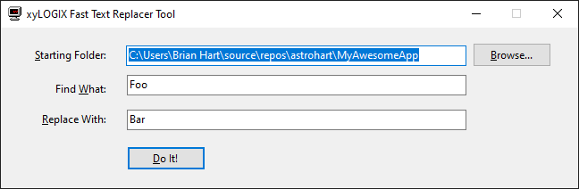

# TextReplacementApp `application`

**Figure 1.** Screenshot of the application main window.

Small Windows Forms utility that illustrates quickly replacing text in all files wihtin a certain directory tree, even if there are lots of them, very rapidly.  This project is customized and adapted specifically for those directory trees that contain C# Solution(s) written using Visual Studio 2022 or higher.